# Cheatsheets

Click on one of the following thumbnails to download one of our cheatsheets.

### 1-html-css

[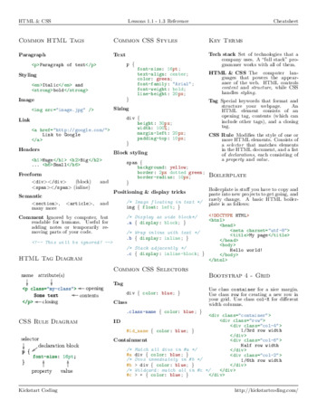](https://github.com/kickstartcoding/cheatsheets/raw/master/build/kickstart-fundamentals/1-html-css.pdf)

### 2-bash-git

[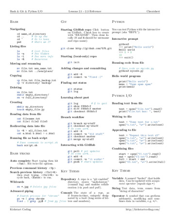](https://github.com/kickstartcoding/cheatsheets/raw/master/build/kickstart-fundamentals/2-bash-git.pdf)

### 3-python

### 4-modules-oop

### 1-http

[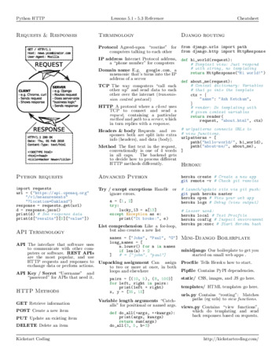](https://github.com/kickstartcoding/cheatsheets/raw/master/build/kickstart-backend/1-http.pdf)

### 2-django

[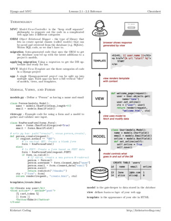](https://github.com/kickstartcoding/cheatsheets/raw/master/build/kickstart-backend/2-django.pdf)

### 3-orm

[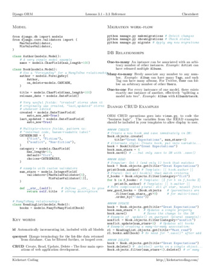](https://github.com/kickstartcoding/cheatsheets/raw/master/build/kickstart-backend/3-orm.pdf)

### 4-postgres

[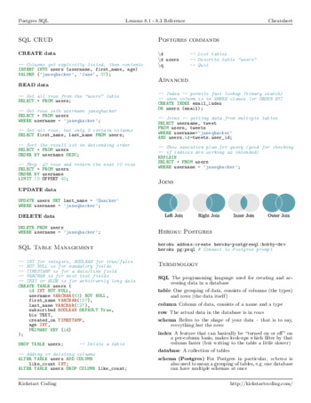](https://github.com/kickstartcoding/cheatsheets/raw/master/build/kickstart-backend/4-postgres.pdf)

### 1-css

[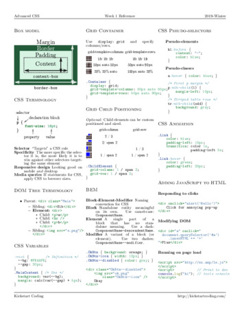](https://github.com/kickstartcoding/cheatsheets/raw/master/build/kickstart-frontend/1-css.pdf)

### 2-javascript

[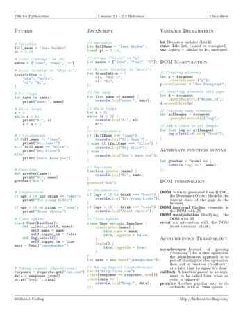](https://github.com/kickstartcoding/cheatsheets/raw/master/build/kickstart-frontend/2-javascript.pdf)

### 3-react

[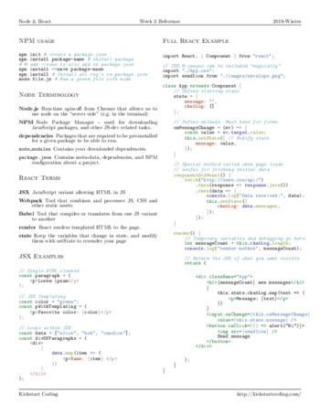](https://github.com/kickstartcoding/cheatsheets/raw/master/build/kickstart-frontend/3-react.pdf)

### 4-components

[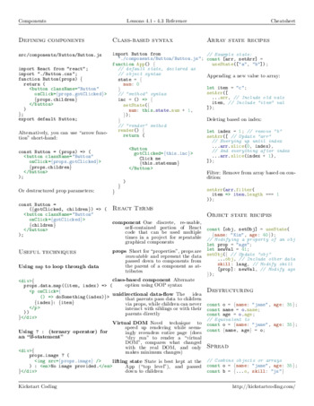](https://github.com/kickstartcoding/cheatsheets/raw/master/build/kickstart-frontend/4-components.pdf)

### 5-mern

[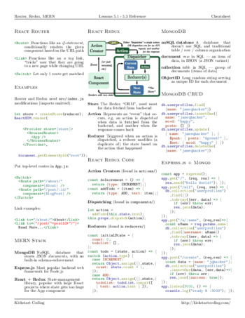](https://github.com/kickstartcoding/cheatsheets/raw/master/build/kickstart-frontend/5-mern.pdf)

### 1-algorithms

[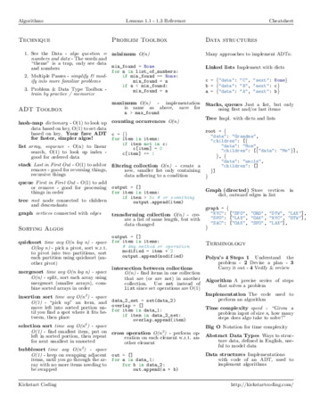](https://github.com/kickstartcoding/cheatsheets/raw/master/build/kickstart-career/1-algorithms.pdf)

### 2-industry

[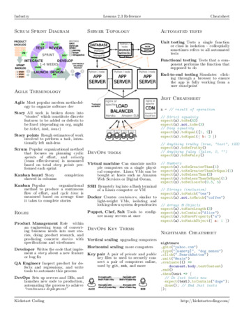](https://github.com/kickstartcoding/cheatsheets/raw/master/build/kickstart-career/2-industry.pdf)

### javascript-for-pythonistas

[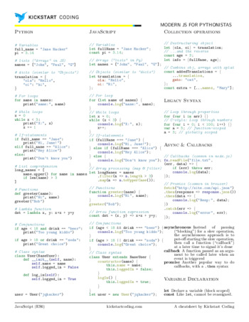](https://github.com/kickstartcoding/cheatsheets/raw/master/build/topical/javascript-for-pythonistas.pdf)

### python-for-js-developers

[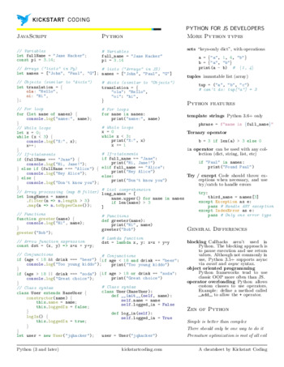](https://github.com/kickstartcoding/cheatsheets/raw/master/build/topical/python-for-js-developers.pdf)

### python

[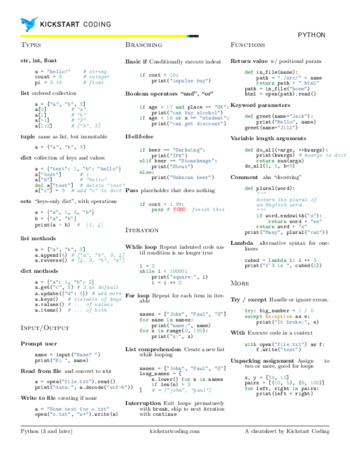](https://github.com/kickstartcoding/cheatsheets/raw/master/build/topical/python.pdf)

### modern-html-css

[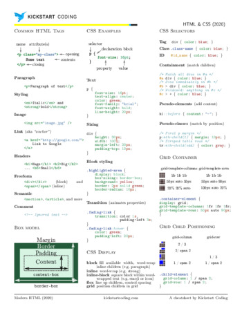](https://github.com/kickstartcoding/cheatsheets/raw/master/build/topical/modern-html-css.pdf)

### django

[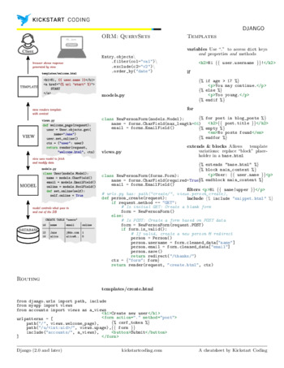](https://github.com/kickstartcoding/cheatsheets/raw/master/build/topical/django.pdf)

### cli-bash

### react-redux

[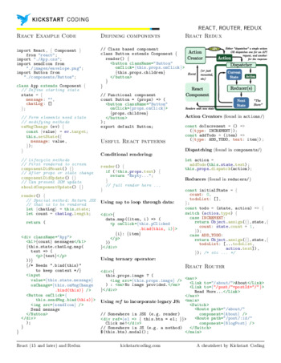](https://github.com/kickstartcoding/cheatsheets/raw/master/build/topical/react-redux.pdf)

### react-hooks-useeffect

