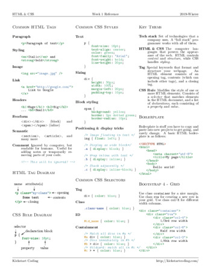
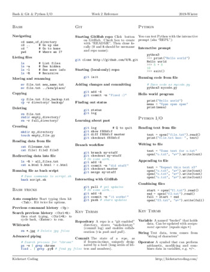
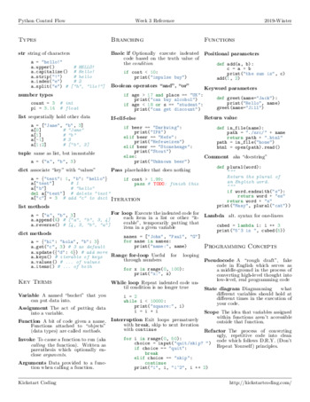
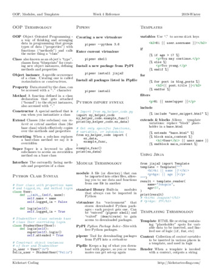
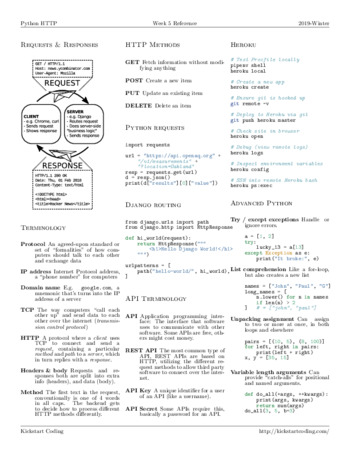
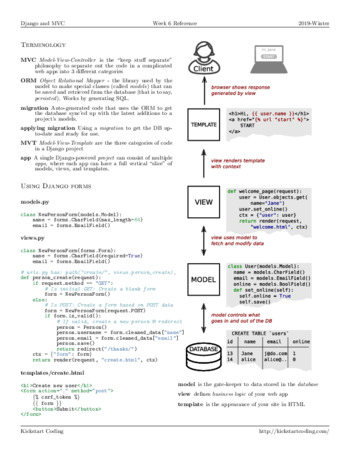
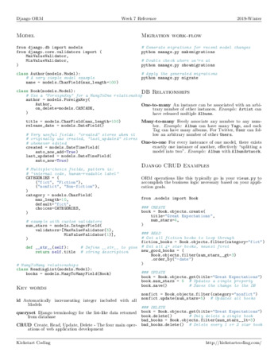
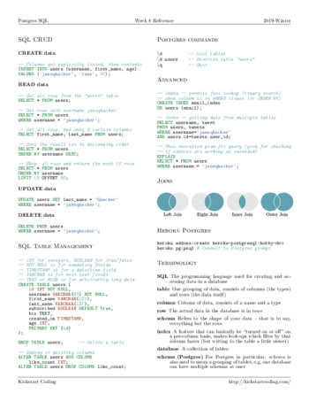
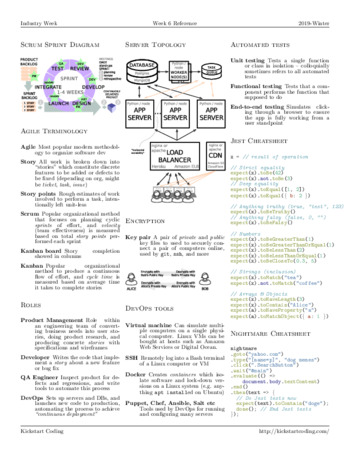
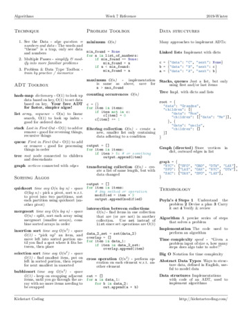

# Cheatsheets

Click on one of the following thumbnails to download one of our cheatsheets.

### 1-html-css

### 2-bash-git

### 3-python

### 4-modules-oop

### 5-http

### 6-django

### 7-orm

### 8-postgres

### 1-css

### 2-javascript

### 3-react

### 4-components

### 5-mern

### 6-industry

### 7-algorithms

### javascript-for-pythonistas

### python-for-js-developers

### python

### modern-html-css

### django

### cli-bash

### react-redux

